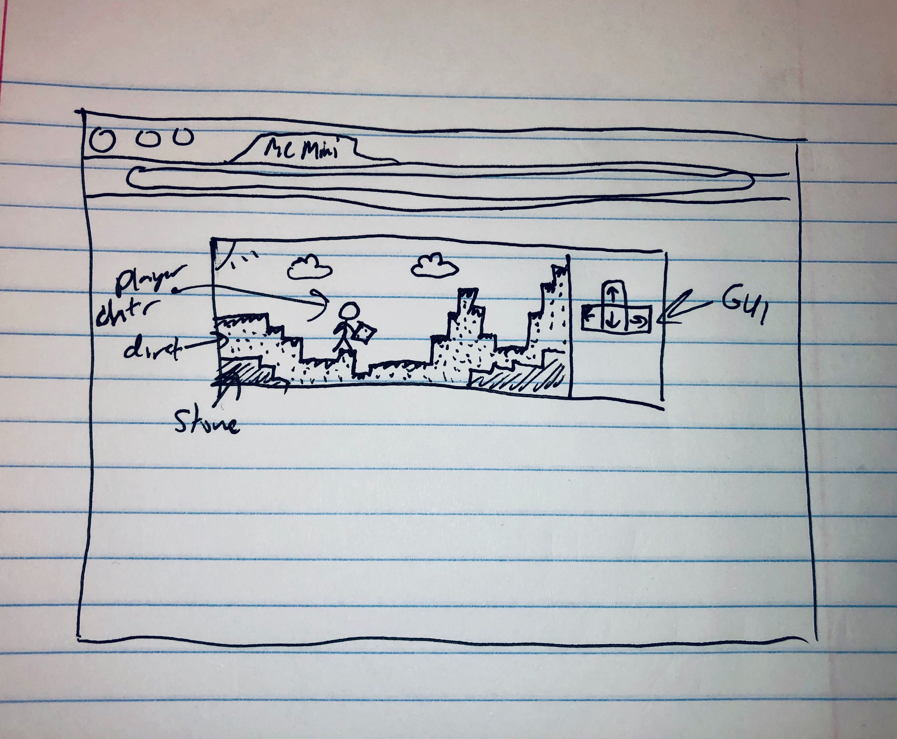

# Project: Minecraft Mini
### by dean

## 1. Basic Game Idea
I want to build a pared down version of minecraft (name subject to change). It will be two dimensional and have limited function, but essentially be a platformer with scenery manipulation.

## 2. Tech
I will use basic HTML, CSS, and JS to create a viewer window where the game takes place. The scenery will be drawn using a css canvas. I will use javascript functionality to track the player's movement, the location of the terrain, and the player's manipulation of the terrain. 

## 3. MVP
Upon loading the page, a randomly spawned terrain will load. There will be dirt blocks on top of stone blocks.  The user will be able to manipulate a player character using WASD or an interface next to the screen (to make accessible for mobile). The user will be able to pick up blocks by clicking on them when the player character is next to them. Then, the block appears in the character's inventory, and they can place the block somewhere else. The stone blocks cannot be picked up.  There will be an objectives menu to tell the players what to do.

## 4. Stretch Goals

- Make the design prettier. Add custom assets and sprites.
- Add a tutorial sequence.
- Add sound effects and sound.
- Add a crafting interface. The player can use wood to make tools to mine stone.
- The gameworld will be expanded beyond the width of the screen. A minimap will be added so the user can know where they are. 

## Wireframe

