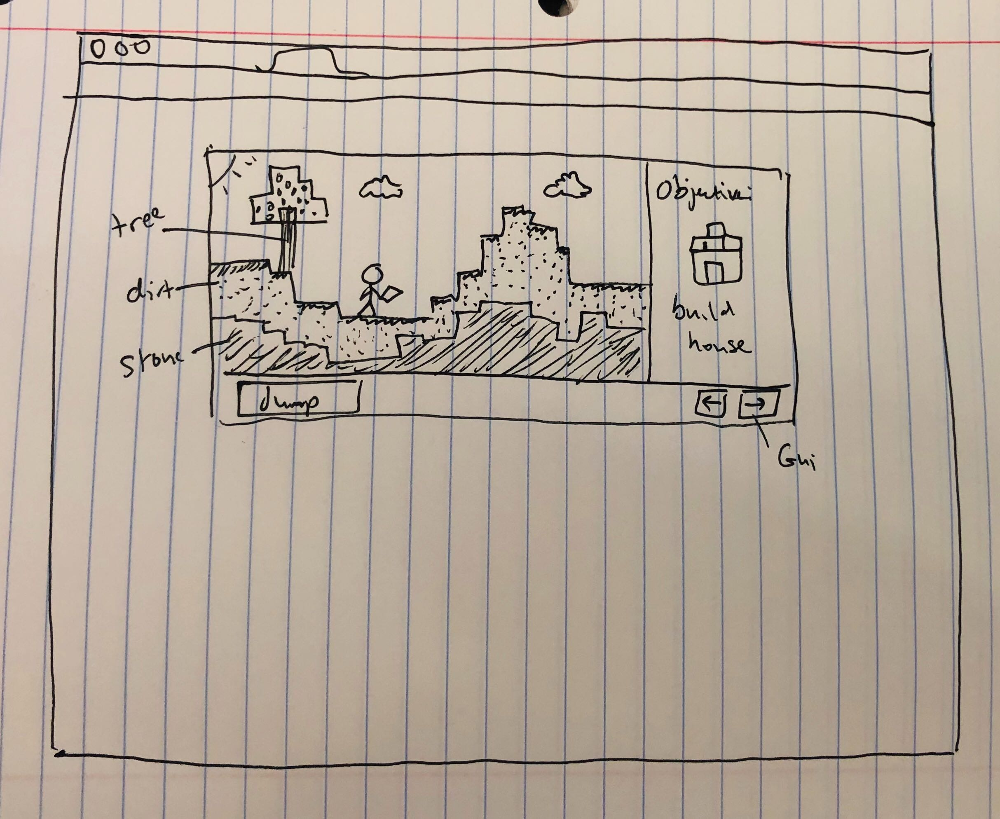

# Project: Minecraft Mini
### by dean

## 1. Basic Game Idea
I want to build a pared down version of minecraft (name subject to change). It will be two dimensional and have limited function, but essentially be a platformer with scenery manipulation.

## 2. Tech
I will use basic HTML, CSS, and JS to create a viewer window where the game takes place. The scenery will be drawn using a css canvas. I will use javascript functionality to track the player's movement, the location of the terrain, and the player's manipulation of the terrain. 

## 3. MVP
Upon loading the page, a randomly spawned terrain will load. There will be dirt blocks on top of stone blocks. The dirt blocks on top rows will have a grassy texture. The user will be able to manipulate a player character using the arrow keys, WASD, or a gui interface next to the screen (to make accessible for mobile). The user will be able to pick up dirt blocks by clicking on them when the player character is next to them. Then, the block appears in the character's hand, and they can place the dirt block somewhere else. The stone blocks cannot be picked up. 

## 4. Stretch Goals
- Create a tutorial sequence that explains how to play the game.
- Add an inventory GUI for players to keep multiple items in their inventory.
- Add randomly spawning trees. The player can destroy trees and pick up the wood. 
- The player can use the wood to build a crafting bench and craft a pickaxe. The player can use the pickaxe to destroy stone blocks.
- Make a day and night function. A sun will traverse the top of the screen and after a certain period of time the game background will change to be night. After a certain period, the background will revert to day.
- The gameworld will be expanded beyond the width of the screen. A minimap will be added so the user can know where they are. 

## Wireframe

